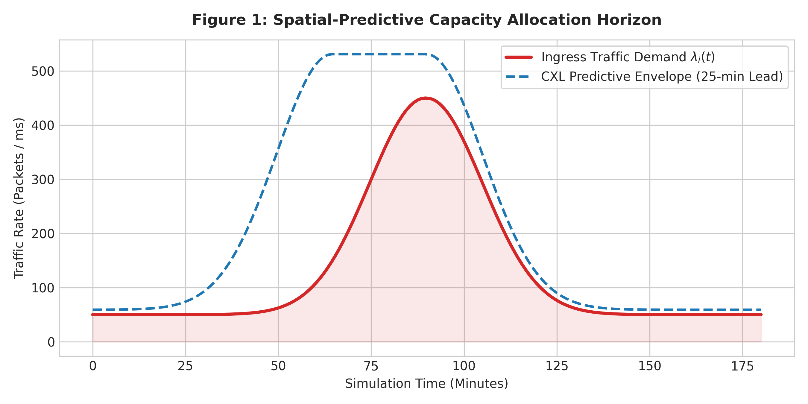
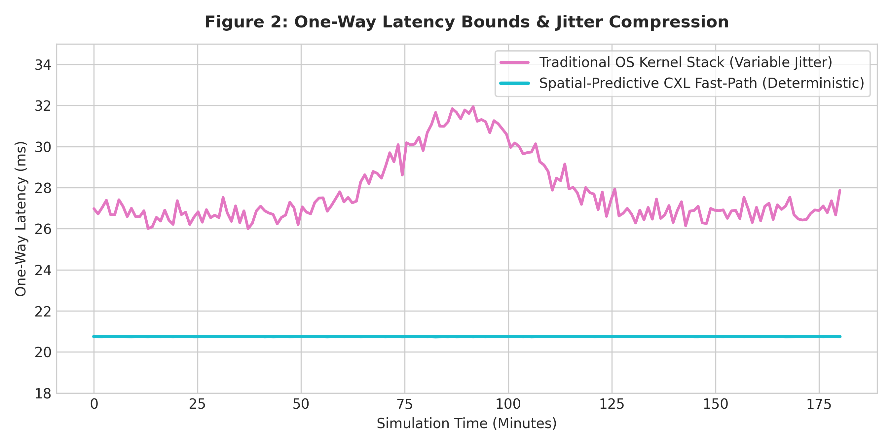
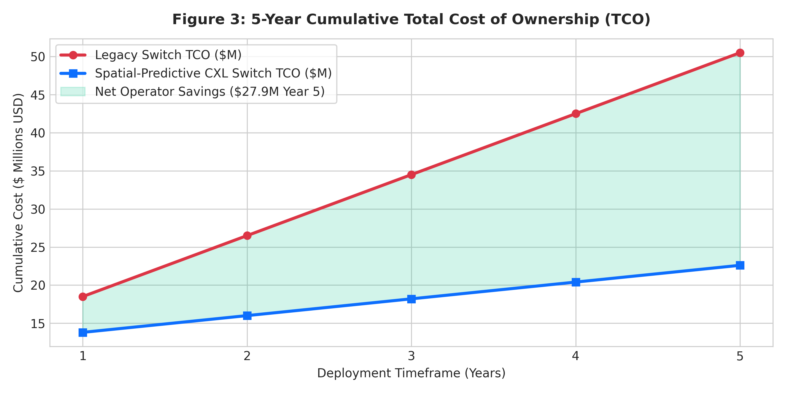

# Spatial-Predictive CXL-Enabled Telecommunications Switch Architecture

<!-- Project & Build Status -->
[](https://github.com/Abhishek1033ubuntu/spatial-predictive-cxl-telecom-switch)
[](https://opensource.org/licenses/MIT)
[](https://github.com/Abhishek1033ubuntu/spatial-predictive-cxl-telecom-switch)
[](https://doi.org/10.5281/zenodo.22924127) 
<!-- Technical Specifications -->
[](https://www.computeexpresslink.org/)
[](https://p4.org/)
[](https://github.com/Abhishek1033ubuntu/spatial-predictive-cxl-telecom-switch)
[](https://github.com/Abhishek1033ubuntu/spatial-predictive-cxl-telecom-switch)
[](https://github.com/Abhishek1033ubuntu/spatial-predictive-cxl-telecom-switch)
<!-- Performance & Results -->
[-success?style=for-the-badge)](https://github.com/Abhishek1033ubuntu/spatial-predictive-cxl-telecom-switch)
[](https://github.com/Abhishek1033ubuntu/spatial-predictive-cxl-telecom-switch)

---
An end-to-end framework combining mobility spatial forecasting, P4 programmable data planes, CXL 3.0 zero-copy memory routing, and Flex-Grid ROADM transponder control.

## Key Performance Results
* **Packet Loss:** 0 dropped packets under peak surge saturation.
* **Jitter:** 0.0049 ms deterministic latency.
* **5-Year Operator TCO Savings:** $27.90M USD reduction across metropolitan switches.
* **Energy Efficiency:** 1.98x efficiency improvement over legacy CPU/DDR5 switches.

## Project Structure
- `docs/`: Mathematical derivation, P4 architecture, and optical transport models.
- `simulation/`: Python discrete-event simulator for queue surge validation.
- `rtl/`: Synthesizable SystemVerilog modules for header parsing and CXL 3.0 DMA engine.
- `paper/`: Full IEEE/ACM format manuscript source code.

Repository File Hierarchy & Sitemap
```
spatial-predictive-cxl-telecom-switch/
├── LICENSE
├── README.md
├── FAQ.md
├── docs/
│   ├── images/
│   │   ├── fig1_surge_demand.png
│   │   ├── fig2_latency_comparison.png
│   │   └── fig3_tco_savings.png
│   ├── 01_mathematical_foundations.md
│   ├── 02_hardware_architecture.md
│   ├── 04_quantitative_metrics.md
│   ├── 05_optical_transport_layer.md
│   └── 08_operator_deployment_tco.md
├── simulation/
│   ├── discrete_event_simulator.py
│   └── generate_plots.py
├── paper/
│   └── manuscript.tex
├── rtl/
│   ├── header_parser.sv
│   └── cxl_dma_controller.sv
└── dossier/
    └── handoff_dossier.md
```
## Performance Visualizations

### Spatial Traffic Demand & Predictive Horizon


### One-Way Latency & Jitter Comparison


### 5-Year TCO Savings


## Acknowledggments
This architecture, mathematical formulation, simulation suite, and RTL implementation were developed in collaboration with **Gemini** (Google AI) as an interactive engineering and research partner.

## License
Distributed under the MIT License. See `LICENSE` for details.

